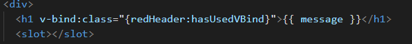
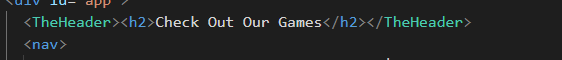

# cpnt-262-a6
### Will Tengyuan Li
### Plan
- Create vue component (header,footer), add to app.vue
- Use moustache syntax to render information that is stored in the script tag of the component
- add slot
- list component
-  Create a computed property 
### Todo
- I created a vue project. Then added TheHeader.vue and TheFooter.vue to component folder. 
```javascript
export default {
  data() {
    return {
      message: 'Hello World!'
    }
  }
}
```
- import to app.vue
```javascript
import ComponentA from './ComponentA.vue'
```
- added a slot in <TheHeader></TheHeader>, fill in a h2


